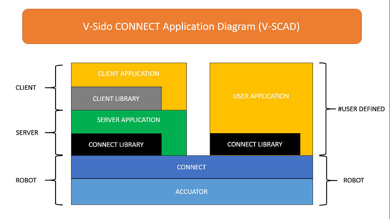

/*! \mainpage V-Sido Server Application Configure JSON コマンドリファレンス
\section intro 1 始めに
\n WebSocketとJSONデータを使って、「V-Sido Server Application」設定を変更する方法を提示する。
\n WebSocketの接続方法とJSONデータ通信フォーマットの説明を行う。
\subsection sytem 1.1 システム構成
</img>

\section Connet 2 WebSocket接続に関しては
<table border="1" width="300" cellspacing="0" cellpadding="5" bordercolor="#333333" style="margin-left:40px;">
<tr>
<td bgcolor="#FFFFCF" align="right" nowrap>接続方式</td>        
<td bgcolor="#FFFFFF" valign="top" width="150">WebSocket</td>
</tr>
<tr>
<td bgcolor="#FFFFCF" align="right" nowrap>ポート</td>        
<td bgcolor="#FFFFFF" valign="top" width="150">20080</td>
</tr>
<tr>
<td bgcolor="#FFFFCF" align="right" nowrap>プロトコール</td>        
<td bgcolor="#FFFFFF" valign="top" width="150">vsido-cmd</td>
</tr>
<tr>
<td bgcolor="#FFFFCF" align="right" nowrap>データフォーマット</td>        
<td bgcolor="#FFFFFF" valign="top" width="150">JSON</td>
</tr>
</table>
* 2.1 接続例(JavaScript):
\code{.js}
var ws = new WebSocket('ws://localhost:20080','vsido-cmd');
\endcode

\section cmd_list 3 コマンド一覧
<table border="1" width="800" cellspacing="0" cellpadding="5" bordercolor="#333333" style="margin-left:40px;">
<tr>
<th bgcolor="#CFCFCF">名称</th>
<th bgcolor="#CFCFCF">コマンド</th>
<th bgcolor="#CFCFCF">機能内容</th>
</tr>

<tr>
<td bgcolor="#FFFFCF" align="right" nowrap>Bluetoothスキャン</td>        
<td bgcolor="#FFFFFF" width="150">ScanBluetooth</td>
<td bgcolor="#FFFFFF" width="450">接続可能なBluetoothデバイスを検出する</td>
</tr>

<tr>
<td bgcolor="#FFFFCF" align="right" nowrap>Bluetoothペアリング</td>        
<td bgcolor="#FFFFFF" width="150">PairBluetooth</td>
<td bgcolor="#FFFFFF" width="450">Bluetoothディバイスとペアリング設定を行う</td>
</tr>

<tr>
<td bgcolor="#FFFFCF" align="right" nowrap>シリアルポート一覧</td> 
<td bgcolor="#FFFFFF" width="150">ListSerialPort</td>
<td bgcolor="#FFFFFF" width="450">通信可能なシリアルポート一覧を取得する</td>
</tr>

<tr>
<td bgcolor="#FFFFCF" align="right" nowrap>シリアルポート選択</td> 
<td bgcolor="#FFFFFF" width="150">SelectSerialPort</td>
<td bgcolor="#FFFFFF" width="450">通信シリアルポートを選択する</td>
</tr>

</table>

\section cmd_common 4 各コマンド共通
* 4.1 各コマンド共通送信JSON形式
\code{.js}
{
	"command": "...",
	...
}
\endcode
\arg command 各コマンドへ参考。

* 4.2 タイムアウトの返事JSON形式(各コマンド共通)
\code{.js}
{
	"type": "timeout"
}
\endcode
* 4.3 エラー時の返事JSON形式(各コマンド共通)
\code{.js}
{
	"type": "error",
	"details": ""  
}
\endcode
\arg details エラーの詳細情報。

\section cmd_details 5 コマンド詳細

\subsection s_bt 5.1 Bluetoothスキャン ScanBluetooth

接続可能なBluetoothデバイスを検出する。

* 送信JSON形式
\code{.js}
{
	"command": "ScanBluetooth"
}
\endcode

* 返事JSON形式
\code{.js}
{
	"type": "ScanBluetooth",
	"device":[
		{"name":"SDBT-xxxx":"mac":"08:00:27:d0:61:59"}
	]
}
\endcode
\arg device Bluetoothデバイス
\arg name Bluetoothデバイス名
\arg mac BluetoothデバイスMACアドレス

\subsection p_bt 5.2 Bluetoothペアリング PairBluetooth

Bluetoothディバイスとペアリング設定を行う。

* 送信JSON形式
\code{.js}
{
	"command": "PairBluetooth",
	"device":{"mac":"08:00:27:d0:61:59"}
}
\endcode

* 返事JSON形式
\code{.js}
{
	"type": "PairBluetooth"
}
\endcode
\arg device Bluetoothデバイス
\arg mac BluetoothデバイスMACアドレス

\subsection l_sp 5.3 シリアルポート一覧 ListSerialPort

通信可能なシリアルポート一覧を取得する。

* 送信JSON形式
\code{.js}
{
	"command": "ListSerialPort"
}
\endcode

* 返事JSON形式
\code{.js}
{
	"type": "ListSerialPort",
	"port":[
		"ttySXXX","COMXXX","ttyUSBXXX","ttyBluetoothXXX"
	]
}
\endcode
\arg port ポート名

\subsection s_sp 5.4 シリアルポート選択 SelectSerialPort

通信シリアルポートを選択する

* 送信JSON形式
\code{.js}
{
	"command": "SelectSerialPort",
	"port":"ttySXXX",
	"baudrate":115200
}
\endcode

* 返事JSON形式
\code{.js}
{
	"type": "SelectSerialPort"
}
\endcode
\arg port ポート名
\arg baudrate ボーレート　※設定されない場合、115200とする。

*/
